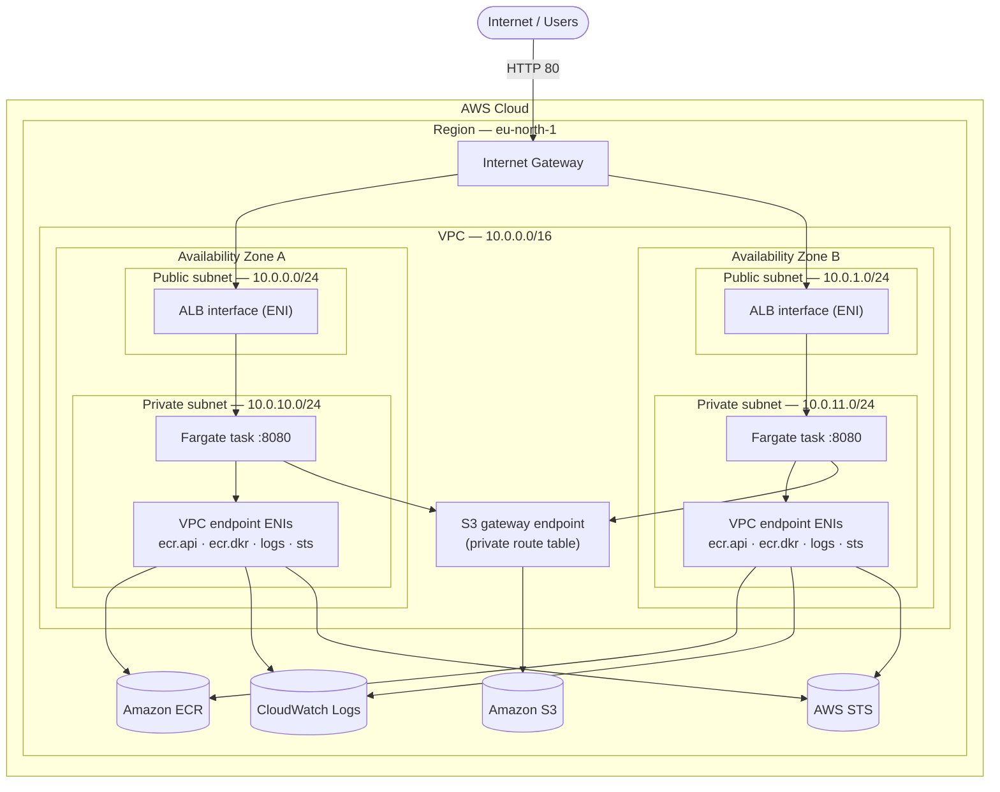
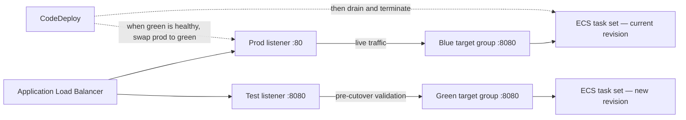
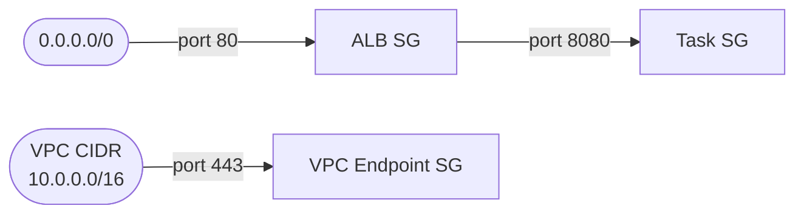
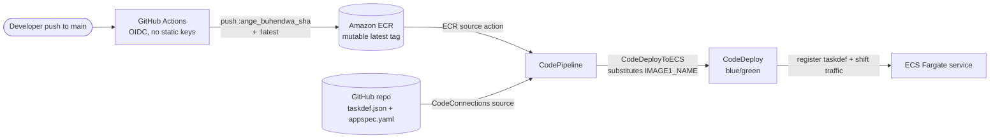

# Architecture — AWS ECS CI/CD Lab

Highly available, containerized Java web app on **Amazon ECS (Fargate)** in a
custom multi-AZ VPC, fronted by a public **Application Load Balancer**, with
**blue/green** deployments driven by image pushes. Infrastructure is provisioned
by **CloudFormation GitSync**; CI authenticates with **GitHub OIDC** (no static
keys). Region: `eu-north-1`.

## 1. Network architecture

Tasks run **inside the private subnets** with no default route to the internet.
All AWS service connectivity goes through **VPC endpoints** — no NAT Gateway.

- Hierarchy: **AWS Cloud → Region → VPC → AZ → subnet → resource.** Two AZs,
  each with a **public** and a **private** subnet.
- ECS tasks sit in the two **private** subnets (`AssignPublicIp: DISABLED`),
  one per AZ for high availability.
- The **ALB** is a single internet-facing load balancer with an interface
  (`albA` / `albB`) in each public subnet. Its **listeners** (`prod :80`,
  `test :8080`) and target-group routing are shown in
  [section 2](#2-bluegreen-traffic-routing).
- **No NAT Gateway**: private subnets have no `0.0.0.0/0` route. ECR image
  pulls use the `ecr.api` + `ecr.dkr` interface endpoints (DNS-resolved
  privately); layer data flows over the `s3` gateway endpoint attached to the
  private route table. CloudWatch Logs uses the `logs` endpoint; STS calls
  (SDK credential refresh) use the `sts` endpoint.
- Image pulls and logging stay entirely on the AWS network — no internet egress
  needed or possible from the task subnets.

> **Why public subnets at all?** The **internet-facing ALB** must be placed in
> IGW-routed subnets to receive inbound traffic. Tasks never sit in the public
> subnets; public subnets exist solely for the ALB.

## 2. Blue/green traffic routing

The ALB has **two listeners** and **two target groups**. "Blue" and "Green" are
just the two interchangeable slots — at any time one holds the live task set and
the other is free for the next release.

During a deploy CodeDeploy launches the new revision into the **idle** target
group (green here), validates it via the test listener + ALB health checks on
`/actuator/health`, then **repoints the production listener** from blue → green.
The old task set is drained and terminated after a wait. The next deploy reverses
the roles.

### How tasks start and terminate (per deploy)

Fargate has **no EC2 instances** — CodeDeploy manipulates ECS **task sets** and
the ALB's **listener-to-target-group** mapping:

1. **Steady state** — the *blue* task set (current revision) is registered in
   the blue target group; prod listener `:80` forwards there.
2. **New deploy** — CodeDeploy registers the new task definition and launches a
   *green* task set registered in the green target group.
3. **Health gate** — ALB health-checks green on `/actuator/health` (Spring Boot
   Actuator). Grace period is 180 s to allow JVM warm-up. CodeDeploy waits until
   green is healthy without touching blue.
4. **Cutover** — CodeDeploy reroutes prod listener `:80` from blue TG to green.
5. **Bake window** — waits 5 min with blue still running for instant rollback.
6. **Terminate old** — blue task set is drained (30 s) and terminated.
7. **Rollback** — if green never becomes healthy the prod listener stays on blue
   and green tasks are terminated.

## 3. Security groups (least privilege)

- **ALB SG** — inbound `80` from `0.0.0.0/0`.
- **Task SG** — inbound app port `8080` only from the ALB SG.
- **VPC Endpoint SG** — inbound `443` from the VPC CIDR (`10.0.0.0/16`), not
  pinned to the task SG. This ensures any future resource in the VPC can reach
  the endpoints without a template change.

## 4. CI/CD and deployment pipeline

1. Push to `main` → GitHub Actions assumes an IAM role via **OIDC** and builds
   the image.
2. Image is tagged **`ange_buhendwa_<sha>`** (immutable, for traceability) and
   **`latest`** (mutable, watched by CodePipeline). Both tags are pushed to ECR.
3. The `latest` push triggers **CodePipeline** via the **ECR source action**
   (which also produces `imageDetail.json` with the exact digest).
4. CodePipeline also pulls `deploy/taskdef.json` and `deploy/appspec.yaml`
   directly from GitHub via a **CodeConnections** source action — no S3 upload.
5. The **CodeDeployToECS** action substitutes `<IMAGE1_NAME>` in `taskdef.json`
   with the actual image URI from `imageDetail.json`, registers the new task
   definition, and runs **blue/green** — see section 2.

### Static deploy files

`taskdef.json` contains no dynamic values except the `<IMAGE1_NAME>` placeholder
(filled by CodeDeploy). Execution and task role ARNs are hardcoded using
deterministic `RoleName` values set in the CloudFormation template.

## 5. Application auto scaling

- ECS service: **min 1 / desired 1 / max 4** tasks.
- Target-tracking on **average CPU = 50%** (`ECSServiceAverageCPUUtilization`).

## 6. Components

| Layer | Resources |
|-------|-----------|
| Network | VPC, 2 public + 2 private subnets, IGW, route tables |
| Connectivity | VPC endpoints: `ecr.api`, `ecr.dkr`, `logs`, `sts` (interface) + `s3` (gateway) |
| Compute | ECS cluster, Fargate task definition, service (CODE_DEPLOY controller) |
| Edge | ALB, prod listener `:80`, test listener `:8080`, blue + green target groups |
| Images | ECR repo (mutable tags, scan-on-push, lifecycle: keep last 10) |
| CI | GitHub Actions + IAM OIDC provider/role (ECR push only) |
| CD | CodeConnections, CodePipeline (GitHub + ECR sources), CodeDeploy app + deployment group |
| Observability | CloudWatch Logs (`/ecs/ecs-cicd`), Container Insights |
| Scaling | Application Auto Scaling target + CPU target-tracking policy |

> Provisioned via **CloudFormation GitSync** from this repository
> (`template.yaml` + `deployment-config.json`). The application code,
> `Dockerfile`, and GitHub Actions workflow live in the app repo.
